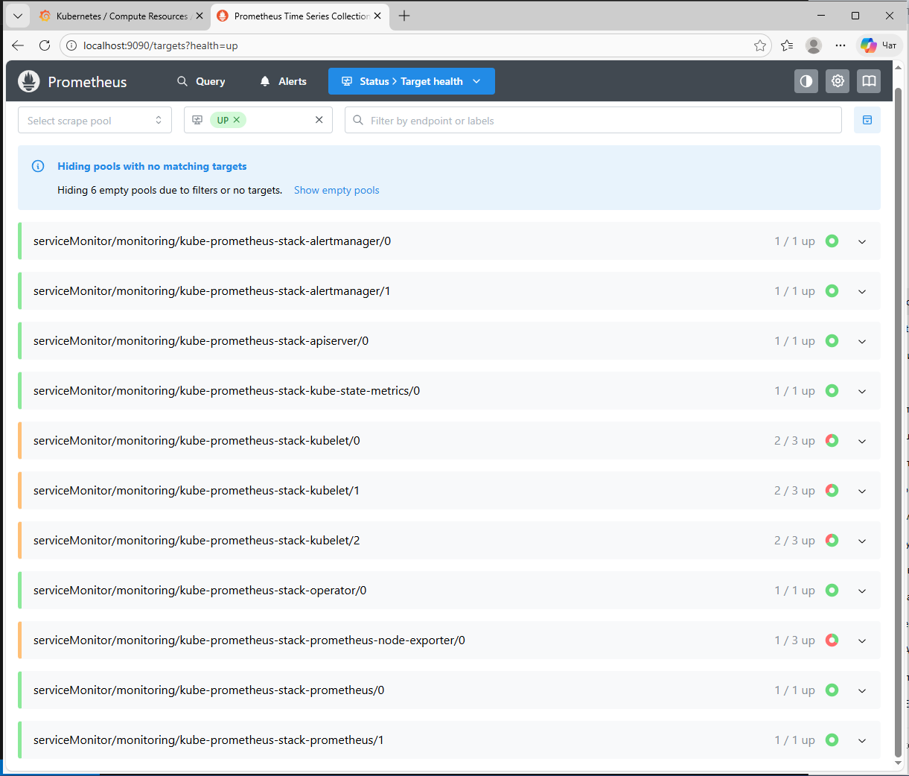

# DevOps Diploma Kubernetes

## Описание
Данный репозиторий служит центральным хранилищем для всех конфигураций и манифестов, управляющих средой `Kubernetes` в рамках дипломного проекта DevOps (Netology). Он содержит декларативные описания системных компонентов, сетевого уровня и инфраструктуры мониторинга, что позволяет воспроизвести и поддерживать состояние всего кластера.

Использование этого репозитория обеспечивает соблюдение принципов `GitOps` и `Infrastructure as Code`, где любое изменение в кластере начинается с коммита в систему контроля версий.

---

## Kubernetes кластер
Кластер Kubernetes был развернут вручную (self-hosted) на виртуальных машинах в Yandex Cloud с использованием утилиты kubeadm. Данный подход предоставил полный контроль над конфигурацией и позволил глубоко изучить внутреннее устройство оркестратора. Архитектура кластера спроектирована с учетом базовых принципов отказоустойчивости и разделения обязанностей.

Кластер состоит из следующих узлов:

- **1 управляющая нода (control-plane / master)**: Отвечает за планирование workload'ов, управление состоянием кластера через API-сервер и работу контроллер-менеджера и scheduler'а.

- **2 рабочие ноды (worker nodes)**: Выполняют рабочие нагрузки (поды). Размещение нод в разных зонах доступности Yandex Cloud обеспечивает устойчивость к сбоям на уровне инфраструктуры.

Для сетевого взаимодействия между подами используется CNI-плагин Flannel с использованием сети 10.244.0.0/16.

---

## Структура репозитория
Репозиторий организован по функциональному признаку, что упрощает навигацию и управление конфигурациями. Каждая директория соответствует ключевому компоненту инфраструктуры.
```
devops-diplom-k8s/
├── ingress/           # Документация и описание ingress-nginx (установка через helm)
├── monitoring/        # Документация по стеку мониторинга (kube-prometheus-stack)
├── apps/              # Манифесты бизнес-приложений (например, тестовое приложение для диплома)
├── system/            # Конфигурации для системных компонентов кластера (например, метрики)
├── scripts/           # Вспомогательные shell- или Python-скрипты для управления кластером
└── README.md          # Данный файл документации
```

---

## Ingress
Управление сетевым доступом **(ingress-nginx)**.

Для централизованного управления входящим HTTP/HTTPS трафиком в кластер был развернут `ingress-nginx`. Этот контроллер работает как обратный прокси-сервер и маршрутизатор, реализуя функцию единой точки входа.

Роль `Ingress` в проекте:

Маршрутизация на основе хоста или пути: Позволяет направлять запросы к разным сервисам внутри кластера на основе доменного имени или URL-пути (например, `app.example.com -> Service frontend`).

Терминирование SSL/TLS: возможно при дальнейшем расширении конфигурации ingress.

Балансировка нагрузки: Распределяет трафик между подами сервиса.

`Ingress`-контроллер был установлен в выделенном namespace `ingress-nginx`. Описание установки и использования ingress-nginx приведено в директории `./ingress/`.


---

## Мониторинг

Система мониторинга и `observability`
Для обеспечения наблюдаемости за состоянием кластера, приложений и инфраструктуры был развернут полный стек мониторинга на базе **kube-prometheus-stack** (ранее `Prometheus Operator`).

Развернутые компоненты и их назначение:

**Prometheus**: Система сбора и хранения временных рядов метрик. В автоматическом режиме обнаруживает цели для сбора метрик (`Services`, `Pods`) через `ServiceMonitor` и `PodMonitor CRD`.

**Grafana**: Платформа для визуализации метрик. Были импортированы стандартные дашборды для мониторинга `Kubernetes`.

**kube-state-metrics**: Служба, которая прослушивает Kubernetes API и генерирует метрики о состоянии объектов (`Deployments`, `Pods`, `Nodes` и т.д.).

**Prometheus Node Exporter**: `DaemonSet`, собирающий низкоуровневые метрики с каждой ноды кластера (CPU, память, диск, сеть).

Все компоненты мониторинга изолированы в namespace monitoring. Описание развертывания и используемых компонентов приведено в `./monitoring/`.

---

## Namespace и доступы

Ресурсы кластера логически разделены по namespace:
- `cicd` — тестовое приложение
- `monitoring` — мониторинг
- `ingress-nginx` — ingress-контроллер
- системные namespace Kubernetes

Доступ CI/CD ограничен namespace `cicd`.
RBAC настроен таким образом, чтобы CI/CD pipeline имел доступ только к namespace `cicd`.
Кластер используется в учебных целях и не предназначен для production-нагрузок.

---

## Скриншоты
В отчёте по дипломному проекту представлены скриншоты:

### Состояние узлов `Kubernetes` кластера

Скриншот показывает результат выполнения команды `kubectl get nodes`. Видно, что все три ноды кластера (один master и два worker) находятся в состоянии **Ready**, что подтверждает корректную работу базовых системных компонентов и сетевого плагина на каждой виртуальной машине.


---

### Работа `Ingress`-контроллера `Nginx`

#### Поды `Ingress Nginx`
На скриншоте показаны все поды контроллера `ingress-nginx-controller` в namespace `ingress-nginx`. Статус **Running** у всех подов подтверждает успешное развертывание и работу сетевого компонента, отвечающего за маршрутизацию входящего трафика в кластер.


#### Сервисы `Ingress Nginx`
Скриншот демонстрирует сервисы, связанные с Ingress-контроллером, включая сервис типа `LoadBalancer` или `NodePort`, который обеспечивает внешний доступ к контроллеру извне кластера.


#### `Ingress`-ресурсы
Отображен созданный Ingress-ресурс, который определяет правила маршрутизации HTTP/HTTPS трафика к внутренним сервисам приложений в кластере. 


---

### Работа системы мониторинга

#### Цели (Targets) Prometheus
Страница `/targets` в веб-интерфейсе Prometheus показывает все источники метрик, которые успешно обнаруживаются и опрашиваются. Скриншот подтверждает, что `Prometheus` собирает метрики с нод кластера, `Kubernetes API` сервера, `kube-state-metrics` и других компонентов.



На скриншоте видно:
- Prometheus UI открыт
- Раздел Status → Target health

Основные компоненты:
- kube-apiserver → UP
- kube-state-metrics → UP
- prometheus → UP
- alertmanager → UP
- operator → UP

Это подтверждает, что:
- kube-prometheus-stack установлен
- Prometheus собирает метрики
- monitoring в кластере работает

#### Дашборды Grafana
На скриншоте представлен список предустановленных дашбордов в `Grafana`. Особое внимание стоит обратить на стандартные дашборды для мониторинга `Kubernetes`, такие как "`Kubernetes / Compute Resources / Cluster`", "`Kubernetes / API Server`" и "`Kubernetes / Compute Resources / Namespace (Pods)`", которые используются для наблюдения за состоянием кластера и приложений.


## Заключение

В рамках данного репозитория реализован полный набор Kubernetes-конфигураций, необходимых для эксплуатации self-hosted кластера в облаке Yandex Cloud. Используемый подход основан на принципах GitOps и Infrastructure as Code, где состояние кластера полностью описывается декларативными манифестами и контролируется через систему контроля версий.

В проекте настроены ключевые компоненты production-like Kubernetes-среды: ingress-контроллер для управления сетевым доступом, система мониторинга на базе kube-prometheus-stack, а также логическое разделение ресурсов по namespace с ограничением доступов для CI/CD.

Данный репозиторий дополняет инфраструктурную и прикладную части дипломного проекта и демонстрирует практическое применение Kubernetes для управления контейнеризованными приложениями и их наблюдаемости.


## Ссылки на связанные репозитории

1. **Инфраструктура**
   - [devops-diplom-infra](https://github.com/asad-bekov/devops-diplom-infra)

2. **Приложение и CI/CD** 
   - [devops-diplom-app](https://github.com/asad-bekov/devops-diplom-app)
---
